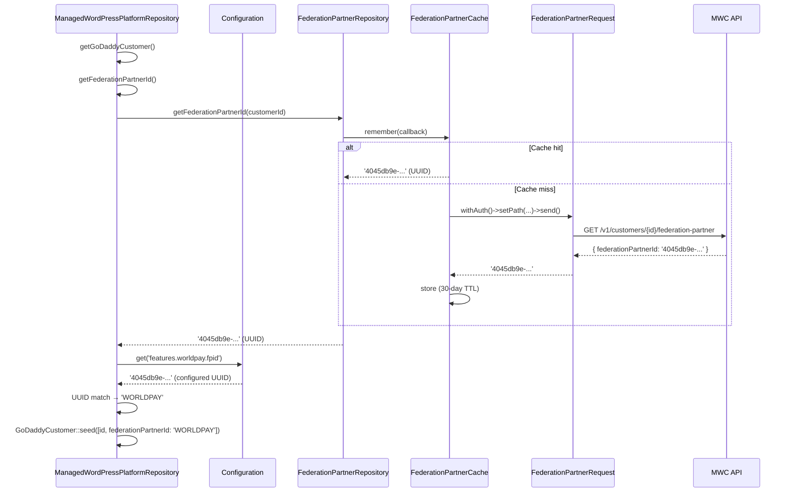

# Design: Federation Partner ID Detection in mwc-core (Part 2)

## Overview

This plan adds federation partner ID (FPID) detection to `mwc-core` by calling the new MWC API endpoint `GET /v1/customers/{customerId}/federation-partner` (built in the separate mwc-api effort). The result is cached aggressively (30-day TTL) and used to populate the `GoDaddyCustomer` model returned by `ManagedWordPressPlatformRepository::getGoDaddyCustomer()`.

This makes the Worldpay feature activation self-contained within mwc-core, removing the dependency on the Pagely hosting config. On woosaas sites, the existing `WooSaaSPlatformRepository` override continues to take precedence — its Pagely-based detection is faster (file read vs API call) and is kept as-is.

## Components

### 1. `FederationPartnerRequest` (new)

**Path:** `src/Features/Worldpay/Http/Requests/FederationPartnerRequest.php`

Follows the `ChannelRequest` pattern exactly.

- Extends `GoDaddyRequest`
- Uses `CanGetNewInstanceTrait`
- Overrides `send()` to set base URL from `ManagedWooCommerceRepository::getApiUrl()` if not already set
- Caller sets path via `->setPath("/v1/customers/{$customerId}/federation-partner")`

### 2. `FederationPartnerCache` (new)

**Path:** `src/Features/Worldpay/Cache/Types/FederationPartnerCache.php`

Follows the `ChannelCache` pattern.

- Extends `Cache implements CacheableContract`
- Uses `CanGetNewInstanceTrait`
- `$expires = 30 * DAY_IN_SECONDS` (30-day TTL, pure time-based — no event invalidation)
- Constructor takes `string $customerId`, sets `type('federation_partner')` and `key("federation_partner_{$customerId}")`
- `@method static static getNewInstance(string $customerId)` docblock for static analysis

### 3. `FederationPartnerRepository` (new)

**Path:** `src/Features/Worldpay/Repositories/FederationPartnerRepository.php`

Follows the `ChannelRepository` pattern — orchestrates cache + request. Returns the **raw UUID** from the MWC API; the UUID-to-`'WORLDPAY'` conversion is handled by the caller.

- Uses `CanGetNewInstanceTrait`
- Single public method: `getFederationPartnerId(string $customerId) : ?string`
  - Uses `FederationPartnerCache::getNewInstance($customerId)->remember(callback)` pattern
  - Inside the callback: calls `FederationPartnerRequest::withAuth()->setPath("/v1/customers/{$customerId}/federation-partner")->send()`
  - On success: extracts `federationPartnerId` (a UUID) from response body using `TypeHelper::string()`
  - On exception: silently catches, returns `null` from callback (cache stores nothing)
  - Returns the cached/fetched string, or `null` if unavailable

### 4. `ManagedWordPressPlatformRepository` (modified)

**Path:** `src/Repositories/ManagedWordPressPlatformRepository.php`

Modify `getGoDaddyCustomer()` to include `federationPartnerId`:

- Current: `GoDaddyCustomer::seed(['id' => $this->getGoDaddyCustomerId()])`
- New: also passes `'federationPartnerId' => $this->getFederationPartnerId()`
- Add protected method `getFederationPartnerId() : string`:
  - Gets customer ID from `$this->getGoDaddyCustomerId()`
  - Returns empty string if customer ID is empty (no API call needed)
  - Fetches the raw UUID via `FederationPartnerRepository::getNewInstance()->getFederationPartnerId($customerId)`
  - Compares the UUID against `Configuration::get('features.worldpay.fpid')`
  - Returns `'WORLDPAY'` if they match, `''` otherwise
  - This mirrors the existing comparison logic in `WooSaaSPlatformRepository::getFederationPartnerId()`

### 5. Configuration (modified)

**Path:** `configurations/features.php`

Add `fpid` to the `worldpay` section:

```php
'worldpay' => [
    // ... existing keys ...
    'fpid' => defined('MWC_FPID') ? MWC_FPID : '4045db9e-1f29-11ed-bad5-fa163e69abfc',
],
```

This value is currently duplicated in woosaas-system-plugin, which can remove its copy since it will inherit from mwc-core via `Configuration::get('features.worldpay.fpid')`. The `MWC_FPID` constant override allows per-site customization.

## Data Flow



## Error Handling

- **MWC API unavailable**: `FederationPartnerRepository` catches exceptions in the `remember()` callback, returns `null`. Cache stores nothing, so the next request will retry. The UUID comparison fails, `getFederationPartnerId()` returns `''`, and `Worldpay::shouldLoad()` returns `false`. This is acceptable — the feature already handles missing FPID gracefully.
- **Empty customer ID**: Short-circuits before making an API call. Returns `''`.
- **Invalid/empty API response**: `TypeHelper::string()` with default `''` ensures a safe fallback. The UUID won't match the configured FPID, so the result is `''`.
- **UUID mismatch**: If the API returns a UUID that doesn't match `features.worldpay.fpid`, the customer is not a Worldpay customer. `getFederationPartnerId()` returns `''`.

## Testing Plan

### New Test: `FederationPartnerRequestTest`

**Path:** `tests/Unit/Features/Worldpay/Http/Requests/FederationPartnerRequestTest.php`

- [ ] `testSetsBaseUrlFromManagedWooCommerceRepositoryWhenNotSet` — verifies URL auto-population
- [ ] `testDoesNotOverrideExistingUrl` — verifies pre-set URL is preserved

### New Test: `FederationPartnerCacheTest`

**Path:** `tests/Unit/Features/Worldpay/Cache/Types/FederationPartnerCacheTest.php`

- [ ] `testSetsCorrectExpiration` — verifies 30 × DAY_IN_SECONDS
- [ ] `testSetsCorrectTypeAndKey` — verifies type is `federation_partner` and key format

### New Test: `FederationPartnerRepositoryTest`

**Path:** `tests/Unit/Features/Worldpay/Repositories/FederationPartnerRepositoryTest.php`

- [ ] `testReturnsCachedFederationPartnerUuid` — cache hit returns UUID, no API call
- [ ] `testFetchesFederationPartnerUuidFromApiOnCacheMiss` — cache miss, API call succeeds, returns UUID
- [ ] `testReturnsNullOnApiException` — API call fails, returns `null`
- [ ] `testReturnsNullOnUnsuccessfulResponse` — API responds with error status, returns `null`

### Modified Test: `ManagedWordPressPlatformRepositoryTest`

**Path:** `tests/Unit/Repositories/ManagedWordPressPlatformRepositoryTest.php`

- [ ] Update `testCanGetGoDaddyCustomer` — now expects `federationPartnerId` to be populated from `getFederationPartnerId()`
- [ ] `testGetFederationPartnerIdReturnsWorldpayWhenUuidMatchesConfig` — UUID matches configured FPID → `'WORLDPAY'`
- [ ] `testGetFederationPartnerIdReturnsEmptyStringWhenUuidDoesNotMatchConfig` — UUID mismatch → `''`
- [ ] `testGetFederationPartnerIdReturnsEmptyStringWhenNoCustomerId` — short-circuit

## Complexity Estimate

| Item | Estimate |
|---|---|
| New files | 3 (request, cache, repository) |
| Modified files | 2 (platform repository, features config) |
| New test files | 3 |
| Modified test files | 1 |
| **Total files** | **9** |
| Estimated complexity | Medium — follows well-established patterns |
