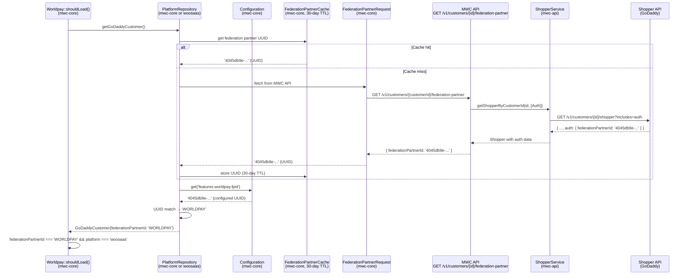
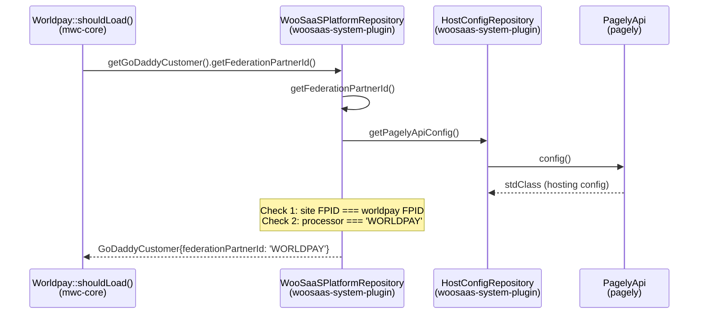

# Requirements: Move Worldpay Federation Partner ID Detection to mwc-core

## Task Description

Move the federation partner ID detection logic from `woosaas-system-plugin`'s `WooSaaSPlatformRepository` into `mwc-core`, sourcing the data from the Shopper API (via a new MWC API endpoint) instead of the Pagely hosting config. This makes the Worldpay feature fully self-contained within `mwc-core` and decoupled from the hosting platform.

## Acceptance Criteria

1. The MWC API has a new `GET /v1/customers/{customerId}/federation-partner` endpoint that returns `{ federationPartnerId: string }` where the value is a raw UUID
2. The MWC API fetches the federation partner UUID from the Shopper API using the `auth` data group
3. The `Shopper` data object in mwc-api has a new `?ShopperAuth $auth` property with `federationPartnerId`
4. mwc-core calls the new MWC API endpoint to retrieve the federation partner UUID
5. mwc-core caches the raw federation partner UUID with a 30-day TTL (pure TTL, no event-based invalidation)
6. mwc-core compares the returned UUID against the configured `features.worldpay.fpid` value and returns `'WORLDPAY'` on match — the UUID-to-`'WORLDPAY'` conversion is a mwc-core concern
7. `Worldpay::shouldLoad()` continues to work correctly for Worldpay sites
8. The `/account` REST API endpoint in mwc-core continues to return the correct `federationPartnerId` value (i.e. `'WORLDPAY'`, not the raw UUID)
9. `woosaas-system-plugin`'s `WooSaaSPlatformRepository::getFederationPartnerId()` remains unchanged — the existing Pagely-based detection is faster (file read vs API call) and continues to work correctly for woosaas sites
10. Tests cover all layers: mwc-api endpoint, mwc-core API client, caching, UUID comparison, and detection logic
11. No breaking changes to the existing Worldpay feature behavior (OverridesInterceptor, ConnectionInterceptor)

## Target Architecture



## Current Architecture (Being Replaced)



---

## Part 1: MWC API Changes

### 1a. New `ShopperAuth` Data Object

Create a Spatie Data object to represent the auth data group from the Shopper API.

**Shopper API response shape** (auth group):
```
ShopperAuth {
    federationPartnerId (string, /^[^<]+$/, {0...256}, optional)
}
```

**Pattern to follow** (existing data objects):
- `mwc-api/app/DataSource/Commerce/DataObjects/ShopperContact.php`
- `mwc-api/app/DataSource/Commerce/DataObjects/ShopperPreference.php`

### 1b. Update `Shopper` Data Object

Add the `auth` property to the existing `Shopper` class.

**Current** (`mwc-api/app/DataSource/Commerce/DataObjects/Shopper.php`):
```php
class Shopper extends Data
{
    public function __construct(
        public readonly string $shopperId,
        public readonly string $customerId,
        public readonly string $email,
        public readonly ?ShopperContact $contact,
        public readonly ?ShopperPreference $preference,
        #[WithCast(DateTimeInterfaceCast::class, format: 'Y-m-d\TH:i:s\.u\Z')]
        public readonly DateTimeImmutable $createdAt,
    ) {
    }
}
```

**Add**: `public readonly ?ShopperAuth $auth` parameter (nullable since auth data group is optional).

### 1c. Update ShopperService Usage

When the new endpoint needs the federation partner ID, it must call `getShopperByCustomerId()` with `ShopperDataGroupEnum::Auth` in the `includedDataGroups` array.

**Existing method** (`mwc-api/app/DataSource/Sources/Commerce/ShopperService.php:92-108`):
```php
public function getShopperByCustomerId(
    string $customerId,
    ?array $includedDataGroups = null,
    ?array $excludedDataGroups = null,
): Shopper {
    // ... makes GET /v1/customers/{customerId}/shopper?includes=auth&excludes=...
}
```

The `includes=auth` query parameter will cause the Shopper API to return the `auth` block with `federationPartnerId`.

### 1d. New Endpoint: `GET /v1/customers/{customerId}/federation-partner`

**Route registration** (follow pattern in `mwc-api/routes/api.php:110-120`):
```php
Route::get('customers/{customerId}/federation-partner', [...])
    ->middleware([PlatformSiteTokenAuthenticationMiddleware::class])
    ->name('customers.federationPartner');
```

**Controller** (follow `ChannelsController` pattern at `mwc-api/app/Http/Controllers/v1/ChannelsController.php`):
- Inject `ShopperService` via method parameter
- Call `ShopperService::getShopperByCustomerId($customerId, [ShopperDataGroupEnum::Auth])`
- Extract `auth.federationPartnerId` from the `Shopper` response
- Return `{ federationPartnerId: string }` as JSON
- Handle exceptions following the channels pattern: `HttpClientException` -> 400, generic `Exception` -> 500

### MWC API Related Files

| File | Layer | Change |
|---|---|---|
| `app/DataSource/Commerce/DataObjects/ShopperAuth.php` | Data Object | **New**: holds `federationPartnerId` |
| `app/DataSource/Commerce/DataObjects/Shopper.php` | Data Object | **Modified**: add `?ShopperAuth $auth` |
| `app/DataSource/Commerce/Enums/ShopperDataGroupEnum.php` | Enum | Reference only (already has `Auth = 'auth'`) |
| `app/DataSource/Sources/Commerce/ShopperService.php` | Service | Reference only (already supports `includedDataGroups`) |
| `app/Http/Controllers/v1/Customers/FederationPartnerController.php` | Controller | **New**: endpoint controller |
| `routes/api.php` | Routes | **Modified**: register new route |
| `app/Http/Controllers/v1/ChannelsController.php` | Controller | Reference: pattern to follow |

---

## Part 2: mwc-core Changes

### 2a. New Request Class

Create a request class to call the MWC API's new endpoint. Follow the `ChannelRequest` pattern.

**Pattern** (`mwc-core/src/Features/Marketplaces/Http/Requests/ChannelRequest.php`):
```php
class ChannelRequest extends GoDaddyRequest
{
    use CanGetNewInstanceTrait;

    public function send() : ResponseContract
    {
        if (empty($this->url)) {
            $this->setUrl(ManagedWooCommerceRepository::getApiUrl());
        }
        return parent::send();
    }
}
```

**Usage** (from `mwc-core/src/Channels/Repositories/ChannelRepository.php:25-33`):
```php
$response = ChannelRequest::withAuth()
    ->setPath("/channels/{$channelId}")
    ->send();
```

The new request will call: `GET {mwcApiUrl}/v1/customers/{customerId}/federation-partner`

The endpoint returns `{ federationPartnerId: string }` where the value is a **raw UUID** (e.g. `4045db9e-1f29-11ed-bad5-fa163e69abfc`), not a partner name like `'WORLDPAY'`.

### 2b. New Cache Class (30-Day TTL)

Follow the `ChannelCache` pattern with a 30-day expiration.

**Pattern** (`mwc-core/src/Channels/Cache/Types/ChannelCache.php`):
```php
class ChannelCache extends Cache implements CacheableContract
{
    use CanGetNewInstanceTrait;
    protected $expires = DAY_IN_SECONDS;

    final public function __construct(string $channelId)
    {
        $this->type('channel');
        $this->key(sprintf('channel_%s', strtolower($channelId)));
    }
}
```

The new cache should use `$expires = 30 * DAY_IN_SECONDS` and key by customer ID. Pure TTL-based — no event-based invalidation. Stores the **raw UUID** from the API.

### 2c. Repository Integration

Update the platform repository's `getGoDaddyCustomer()` to populate `federationPartnerId` from the cached MWC API response.

**Current `WooSaaSPlatformRepository::getGoDaddyCustomer()`** (`woosaas-system-plugin/src/App/Repositories/WooSaaSPlatformRepository.php:143-149`):
```php
public function getGoDaddyCustomer() : GoDaddyCustomerContract
{
    return GoDaddyCustomer::seed([
        'id'                  => $this->getGoDaddyCustomerId(),
        'federationPartnerId' => $this->getFederationPartnerId(),
    ]);
}
```

**Current `ManagedWordPressPlatformRepository::getGoDaddyCustomer()`** (`mwc-core/src/Repositories/ManagedWordPressPlatformRepository.php`):
```php
public function getGoDaddyCustomer() : GoDaddyCustomerContract
{
    return GoDaddyCustomer::seed(['id' => $this->getGoDaddyCustomerId()]);
}
```

The new implementation should: check cache -> if miss, call MWC API -> store raw UUID in cache -> compare UUID against `Configuration::get('features.worldpay.fpid')` -> if match, seed GoDaddyCustomer with `federationPartnerId: 'WORLDPAY'`, otherwise `''`. The UUID-to-`'WORLDPAY'` conversion is a mwc-core concern — the API only returns the raw UUID.

### 2d. FPID Configuration

Add `fpid` to `mwc-core/configurations/features.php` worldpay section. This configured UUID is compared against the UUID returned by the MWC API to identify Worldpay customers — it is essential for the UUID-to-`'WORLDPAY'` conversion.

**Currently missing** from mwc-core but present in woosaas-system-plugin:
```php
'fpid' => defined('MWC_FPID') ? MWC_FPID : '4045db9e-1f29-11ed-bad5-fa163e69abfc',
```

### mwc-core Related Files

| File | Layer | Change |
|---|---|---|
| New request class (e.g. `src/Features/Worldpay/Http/Requests/FederationPartnerRequest.php`) | HTTP | **New**: MWC API client |
| New cache class (e.g. `src/Features/Worldpay/Cache/Types/FederationPartnerCache.php`) | Cache | **New**: 30-day TTL for raw UUID |
| New repository class (e.g. `src/Features/Worldpay/Repositories/FederationPartnerRepository.php`) | Repository | **New**: orchestrates cache + request, returns raw UUID |
| `src/Repositories/ManagedWordPressPlatformRepository.php` | Repository | **Modified**: fetch UUID from MWC API, compare against configured FPID, return `'WORLDPAY'` on match |
| `configurations/features.php` | Config | **Modified**: add `fpid` to worldpay section (used for UUID comparison) |
| `src/Features/Worldpay/Worldpay.php` | Feature | Reference: consumer of `getFederationPartnerId()` |
| `src/API/Controllers/AccountController.php` | API | Reference: exposes `federationPartnerId` |
| `src/Channels/Repositories/ChannelRepository.php` | Repository | Reference: pattern for cached API calls |
| `src/Channels/Cache/Types/ChannelCache.php` | Cache | Reference: cache class pattern |
| `src/Features/Marketplaces/Http/Requests/ChannelRequest.php` | HTTP | Reference: request class pattern |

---

## Part 3: woosaas-system-plugin — No Changes

The existing Pagely-based detection in `WooSaaSPlatformRepository::getFederationPartnerId()` is kept as-is. It reads the FPID from a local file (Pagely hosting config), which is faster than making an API call. Since `WooSaaSPlatformRepository` overrides `getGoDaddyCustomer()`, it takes precedence over the new mwc-core logic on woosaas sites.

The mwc-core changes provide FPID detection for sites that don't run woosaas-system-plugin (i.e. MWP sites using `ManagedWordPressPlatformRepository`).

**Existing implementation** (kept unchanged, `woosaas-system-plugin/src/App/Repositories/WooSaaSPlatformRepository.php:156-170`):
```php
protected function getFederationPartnerId() : string
{
    $siteFpid = $this->getAppIdentifierFromPagelyConfiguration('fpid', '');
    $worldpayFpid = Configuration::get('features.worldpay.fpid');

    if ($siteFpid && $worldpayFpid && $siteFpid === $worldpayFpid) {
        return 'WORLDPAY';
    }

    if ($this->getBusinessCredentialFromPagelyConfiguration('processor', '') === 'WORLDPAY') {
        return 'WORLDPAY';
    }

    return '';
}
```

### woosaas-system-plugin Related Files

| File | Layer | Change |
|---|---|---|
| `src/App/Repositories/WooSaaSPlatformRepository.php` | Repository | **No changes**: existing Pagely-based detection kept |
| `configurations/features.php` | Config | **Modified**: remove `worldpay.fpid` entry (inherited from mwc-core) |
| `tests/Unit/App/Repositories/WooSaaSPlatformRepositoryTest.php` | Test | **No changes** |

---

## Extracted Patterns

### mwc-api: Spatie Data objects
- Properties are `readonly` with constructor promotion
- `#[MapInputName()]` for API field name mapping
- `#[WithCast()]` for complex types
- Nullable for optional nested objects (e.g. `?ShopperContact $contact`)
- `Shopper::from($response->json())` hydrates automatically

### mwc-api: Controller pattern (channels example)
- Inject service via method parameter
- Catch `HttpClientException` -> `HttpException(code ?: 400)`
- Catch generic `Exception` -> report to Sentry, `HttpException(500)`
- Return `response()->json($data, $statusCode)`

### mwc-api: Route registration
- Routes in `routes/api.php` under `v1` prefix group
- `PlatformSiteTokenAuthenticationMiddleware` for authenticated endpoints
- Named routes with dot notation

### mwc-core: Cached API calls (channels example)
```php
$cached = ChannelCache::getNewInstance($id)->remember(static function () use ($id) {
    $response = ChannelRequest::withAuth()->setPath("/channels/{$id}")->send();
    return $response->isSuccess() ? $response->getBody() : null;
});
```

For the federation partner flow, the cache stores the **raw UUID** from the API. The UUID-to-`'WORLDPAY'` comparison happens in the platform repository after fetching from the cache/API, not inside the cached value itself.

### mwc-core: Request class pattern
- Extend `GoDaddyRequest` with `CanGetNewInstanceTrait`
- Set URL from `ManagedWooCommerceRepository::getApiUrl()` if not already set
- Use `::withAuth()` for authenticated requests
- Chain `->setPath()` for endpoint path

### mwc-core: Cache class pattern
- Extend `Cache implements CacheableContract` with `CanGetNewInstanceTrait`
- Set `$expires` for TTL, `$key` pattern with identifier, `$type` for namespace
- Use `->remember(callback)` for lazy evaluation with cache

## Implementation Considerations

1. **Deployment order**: mwc-api must be deployed first (new endpoint), then mwc-core updated to consume it. The woosaas-system-plugin changes can come last.

2. **Cache cold start**: On first request or after cache clear, a live API call is required. If the MWC API or Shopper API is unavailable, `getFederationPartnerId()` will return empty/null and the Worldpay feature won't load. This is acceptable — the feature already handles missing FPID gracefully.

3. **Backward compatibility**: The Pagely-based detection in `WooSaaSPlatformRepository` is kept permanently — it's faster (file read vs API call) and already works for woosaas sites. The mwc-core changes add FPID detection for MWP sites that don't have woosaas-system-plugin.

4. **MWC_FPID constant override**: The `MWC_FPID` constant override remains necessary — the configured UUID is compared against the UUID returned by the API to determine if a customer is a Worldpay customer. The constant allows per-site customization of the expected Worldpay UUID.

5. **Customer ID availability**: The new endpoint requires a `customerId`. Verify this is available in the platform repository context when `getGoDaddyCustomer()` is called.

## Out of Scope Reference: ConfigurationLoader

The `woosaas-system-plugin` also contains a `ConfigurationLoader` (`src/App/Configuration/Worldpay/ConfigurationLoader.php`) that loads Poynt payment credentials from the Pagely hosting config. This is not in scope for this change but is documented here for future reference.

**What it does:**
- Implements `ConditionalComponentContract`, only loads when `Worldpay::shouldLoad()` is true
- Reads from `HostConfigRepository::getPagelyApiConfig()`:
  - `appIdentifiers.purchasingBusinessId` -> `payments.poynt.applicationId` (as `urn:app:{id}`), `payments.poynt.businessId`
  - `appIdentifiers.purchasingStoreId` -> `payments.poynt.siteStoreId`
  - `businessCredentials.{businessId}.appId` -> `payments.poynt.appId`
  - `businessCredentials.{businessId}.privateKey` -> `payments.poynt.privateKey`
  - `businessCredentials.{businessId}.publicKey` -> `payments.poynt.publicKey`
- Gracefully handles missing/partial config (returns early without setting incomplete values)
- Registered as a component in `App::$componentClasses`

**Source files:**
- `woosaas-system-plugin/src/App/Configuration/Worldpay/ConfigurationLoader.php`
- `woosaas-system-plugin/tests/Unit/App/Configuration/Worldpay/ConfigurationLoaderTest.php`
- Registration: `woosaas-system-plugin/src/App/App.php`

Moving this to mwc-core will require similar work — credentials would need to come from the MWC API or another abstracted source rather than the Pagely hosting config.
